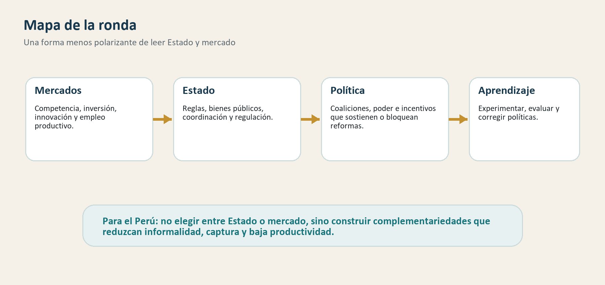

# Ronda 1: ¿Puede haber buenos mercados sin un Estado capaz?

## Para abrir la conversación

En el Perú, el debate económico suele encenderse rápido: Estado contra mercado,
izquierda contra derecha, intervención contra libertad económica. Esa forma de
discutir puede movilizar políticamente, pero no siempre ayuda a entender cómo
se construye desarrollo.

La pregunta de esta ronda intenta salir de esa trampa. No parte de defender
“más Estado” ni “más mercado”, sino de explorar una idea más exigente: los
buenos mercados necesitan capacidades públicas, y los Estados que buscan
desarrollo necesitan mercados dinámicos, inversión, competencia, innovación y
empleo productivo.

El problema no es solo elegir entre Estado o mercado. Es entender cuándo se
complementan, cuándo se bloquean y cuándo uno captura o debilita al otro.

## Mapa de la ronda

La discusión se organiza alrededor de cuatro ideas:

- no hay receta universal de desarrollo;
- el Estado puede resolver problemas que los mercados no resuelven solos;
- las reformas económicas fallan si ignoran la política;
- la política productiva requiere aprendizaje, disciplina y capacidad pública.

## 1. No hay recetas universales

*Goodbye Washington Consensus, Hello Washington Confusion?* — Rodrik (2006)

### La pregunta

¿Qué reemplaza al viejo paquete de reformas asociado al Consenso de Washington?
Rodrik revisa un informe del Banco Mundial sobre las reformas de los años
noventa y sostiene que el debate ya no puede reducirse a liberalizar,
privatizar y estabilizar como receta general.

### Evidencia y argumento

El artículo es una revisión crítica de política de desarrollo. Su punto central
es que las restricciones al crecimiento difieren entre países. En algunos casos
el problema puede ser macroeconómico; en otros, falta de infraestructura,
debilidad institucional, bajo retorno a la inversión, fallas de coordinación o
insuficiente aprendizaje productivo.

Por eso, Rodrik defiende una aproximación diagnóstica: identificar los cuellos
de botella relevantes, experimentar con reformas selectivas y aprender de sus
resultados. La buena política económica no consiste en aplicar una lista fija,
sino en adaptar principios generales a problemas concretos.

El punto es importante porque cambia la manera de discutir reformas. Una
política puede sonar razonable en abstracto, pero ser secundaria si no ataca la
restricción principal. Por ejemplo, simplificar trámites puede ayudar poco si el
cuello de botella real es infraestructura; invertir en infraestructura puede
rendir menos si la restricción principal es inseguridad jurídica; liberalizar un
mercado puede no aumentar productividad si las firmas no tienen capacidades,
crédito, información o conexiones para competir.

Rodrik no propone abandonar la disciplina económica. Propone usarla con más
humildad. En lugar de una lista universal, sugiere una secuencia de diagnóstico,
experimentación y aprendizaje. Esta idea es especialmente útil para países
donde el debate público busca respuestas rápidas: menos “modelo correcto” y
más identificación precisa de restricciones.

### Qué aporta

Para una conversación polarizada, este texto sirve como antídoto. No dice que
el mercado no importe ni que el Estado deba hacerlo todo. Dice que las reformas
deben responder a restricciones específicas y que la diversidad institucional
puede ser compatible con el desarrollo.

También ayuda a ordenar la discusión peruana. Si una región no despega, puede
ser por mala conectividad, baja seguridad, falta de capacidades laborales,
ausencia de proveedores, baja calidad de servicios públicos o reglas
impredecibles. Cada explicación lleva a una política distinta. El debate
“Estado o mercado” se vuelve demasiado grueso para captar esas diferencias.

### Límite

El texto no entrega una guía operativa para el Perú. Su valor está en cambiar
la pregunta: antes de discutir si una reforma es “pro-Estado” o “pro-mercado”,
hay que preguntar qué problema intenta resolver y qué evidencia tenemos de que
ese es el cuello de botella.

## 2. El Estado como coordinador del desarrollo

*State and Development: The Need for a Reappraisal of the Current Literature* — Bardhan (2016)

### La pregunta

¿Qué funciones cumple el Estado en el desarrollo que los mercados y las firmas
privadas no resuelven por sí solos? Bardhan revisa la literatura sobre Estado e
instituciones y pide una mirada menos simplificada.

### Evidencia y argumento

El artículo discute fallas de coordinación, acción colectiva, transformación
estructural, capacidad estatal, coaliciones políticas, descentralización,
rendición de cuentas y conflictos entre compromiso y control. Una economía
puede necesitar inversión complementaria en infraestructura, educación,
tecnología o logística, pero ningún actor privado tiene incentivos suficientes
para coordinar todo el proceso.

El Estado puede ayudar a resolver esos problemas, pero no lo hace
automáticamente. También puede ser capturado, actuar con baja capacidad o
sostener equilibrios políticos que reparten rentas sin generar productividad.

Bardhan enfatiza que el desarrollo requiere algo más que proteger derechos de
propiedad o reducir costos de transacción. Esas funciones importan, pero no
agotan el problema. Las economías pobres suelen necesitar transformación
estructural: mover recursos hacia actividades de mayor productividad, coordinar
inversiones complementarias y construir capacidades colectivas que ningún actor
individual puede financiar por completo.

La coordinación es el ejemplo central. Una empresa puede querer invertir, pero
necesita carreteras, energía, trabajadores capacitados, proveedores, reglas
estables y acceso a mercados. Si cada actor espera a que los demás inviertan,
el equilibrio puede quedar atrapado en baja productividad. En esos casos, el
Estado puede organizar expectativas, reducir incertidumbre y crear bienes
públicos que hagan viables nuevas actividades.

Pero Bardhan no idealiza al Estado. Un Estado con baja rendición de cuentas
puede prometer demasiado, sostener privilegios o repartir rentas para mantener
coaliciones políticas. Por eso el problema no es solo “más funciones públicas”,
sino capacidades públicas con controles, legitimidad y límites.

### Qué aporta

Bardhan ayuda a evitar dos caricaturas. La primera: creer que los mercados
siempre coordinan espontáneamente el desarrollo. La segunda: creer que basta
con darle más funciones al Estado. La pregunta correcta es qué capacidades,
controles y coaliciones permiten que el Estado cumpla funciones productivas.

Para el Perú, esta lectura abre una discusión potente: el país puede tener
sectores exportadores competitivos y, al mismo tiempo, fallas de coordinación
que impiden encadenamientos, innovación o integración territorial. El Estado
puede ser necesario para resolver esas fallas, pero si no tiene capacidad puede
convertir la intervención en burocracia, discrecionalidad o captura.

### Límite

Es una revisión conceptual amplia. No prueba que una política estatal concreta
vaya a funcionar en un país específico. Más bien ofrece un mapa de mecanismos
que deben estudiarse con evidencia local.

## 3. Las reformas económicas también cambian la política

*Economics versus Politics: Pitfalls of Policy Advice* — Acemoglu y Robinson (2013)

### La pregunta

¿Qué pasa cuando los economistas recomiendan políticas ignorando sus efectos
políticos? Acemoglu y Robinson critican la idea de que basta con identificar
una falla de mercado y removerla rápidamente.

### Evidencia y argumento

El ensayo muestra que las políticas actuales pueden modificar equilibrios
políticos futuros. Una reforma técnicamente atractiva puede fortalecer actores
que luego bloqueen cambios más profundos, debilitar coaliciones reformistas o
alterar la distribución de poder de manera contraproducente.

Esto no significa abandonar el análisis económico, sino ampliarlo. La política
económica debe considerar incentivos, poder, coaliciones y efectos dinámicos.
Una reforma puede ser correcta en el pizarrón y frágil en la práctica.

El argumento es incómodo porque obliga a pensar en el tiempo. Una política no
solo corrige una distorsión hoy; también cambia quién gana recursos, quién
adquiere poder y quién tendrá capacidad de influir mañana. Si una reforma
fortalece a un grupo que luego bloquea competencia, transparencia o mayor
capacidad estatal, su efecto de largo plazo puede ser peor que su efecto
inmediato.

Esto es especialmente relevante para reformas que se presentan como técnicas y
neutrales. Privatizaciones, subsidios, desregulación, regulación nueva,
programas sociales o políticas de promoción productiva pueden crear coaliciones
beneficiadas. Algunas coaliciones sostienen mejoras; otras defienden rentas.
La evaluación económica debe mirar ambos planos: eficiencia inmediata y
equilibrio político posterior.

La idea tampoco implica parálisis. No quiere decir que toda reforma sea
imposible porque “la política contamina todo”. Quiere decir que el diseño debe
anticipar incentivos políticos: transparencia, reglas de salida, competencia,
rendición de cuentas, distribución de beneficios y mecanismos para evitar que
los beneficiarios capturen el programa.

### Qué aporta

Para el Perú, esta lectura es especialmente útil en contexto electoral. Muchas
propuestas se presentan como si solo hiciera falta voluntad o técnica. Pero las
reformas viven dentro de un sistema político fragmentado, con actores que ganan
y pierden, con capacidad desigual para bloquear o capturar cambios.

También ayuda a leer por qué algunas reformas no sobreviven. No basta con que
un diagnóstico sea correcto; debe existir una coalición capaz de sostenerlo, una
implementación creíble y mecanismos para que los beneficios no se concentren en
grupos que luego bloqueen ajustes.

### Límite

El texto no ofrece una fórmula para diseñar coaliciones reformistas. Su aporte
es advertir que las políticas económicas no operan en el vacío.

## 4. Política industrial sin nostalgia ni ingenuidad

*The New Economics of Industrial Policy* — Juhász, Lane y Rodrik (2024)

### La pregunta

¿Ha cambiado la forma en que los economistas piensan la política industrial?
Juhász, Lane y Rodrik revisan una literatura reciente que estudia políticas
orientadas a transformar estructuras productivas, promover aprendizaje y
resolver fallas de coordinación.

### Evidencia y argumento

La revisión muestra que la política industrial contemporánea no se reduce al
viejo proteccionismo ni a subsidios permanentes. Puede incluir apoyo a
innovación, coordinación de inversiones, infraestructura específica, compras
públicas, capacitación, encadenamientos y tecnologías estratégicas.

Pero el texto también obliga a tomar en serio los riesgos: captura, mala
selección de sectores, desperdicio de recursos y falta de disciplina para
retirar apoyos cuando no funcionan. La política industrial exige capacidad
estatal, evaluación y mecanismos de corrección.

La contribución de esta literatura es separar la política industrial moderna de
dos imágenes antiguas. La primera es la nostalgia por un Estado que decide desde
arriba qué sectores deben ganar y los protege indefinidamente. La segunda es la
idea de que cualquier intervención productiva está condenada a fracasar por
captura o mala información. La discusión actual es más práctica: bajo qué
condiciones una política puede resolver fallas de coordinación, aprendizaje o
innovación sin convertirse en privilegio.

El énfasis en aprendizaje es clave. Muchas actividades productivas requieren
probar tecnologías, entrenar trabajadores, conectar proveedores, crear
estándares, adaptar conocimiento y asumir costos iniciales que las firmas no
siempre pueden capturar individualmente. Si una empresa invierte y demuestra
que una actividad funciona, otras pueden copiarla; por eso puede haber
subinversión privada en descubrimiento productivo.

Pero la respuesta pública debe venir con disciplina. Si el apoyo no tiene metas,
plazos, evaluación y posibilidad de retiro, puede transformarse en protección a
firmas poco productivas. La política industrial moderna, en su mejor versión,
no es un cheque en blanco: es una apuesta condicionada, evaluable y corregible.

### Qué aporta

Esta lectura conecta el debate Estado-mercado con la diversificación
productiva. El punto no es sustituir al mercado, sino crear condiciones para
que aparezcan actividades de mayor productividad cuando existen fallas de
aprendizaje, coordinación o información.

En el Perú, esto conversa directamente con minería, agroexportación, pesca,
turismo, servicios, ciudades intermedias y proveedores locales. La pregunta no
es si el Estado debe “escoger ganadores” de manera arbitraria, sino si puede
ayudar a construir capacidades comunes: infraestructura, certificaciones,
tecnología, formación, investigación aplicada, logística y encadenamientos.

### Límite

Como lectura complementaria, conviene usarla con cautela. No toda política
industrial es buena por llamarse “industrial”, y no todo país tiene capacidad
para implementarla bien. Justamente por eso vuelve al tema central de la
ronda: sin Estado capaz, las intervenciones pueden volverse captura.

## Reflexión para el Perú

### Lo que la literatura permite afirmar

Estas lecturas respaldan una idea común: el desarrollo no se entiende bien como
una elección simple entre Estado y mercado. Los mercados necesitan reglas,
infraestructura, información, seguridad jurídica, bienes públicos y regulación.
El Estado necesita mercados que produzcan, inviertan, innoven, compitan y
generen empleo.

Cuando esa complementariedad falla, no aparece necesariamente un “mercado
libre” ni un “Estado social”. Puede aparecer informalidad, baja productividad,
servicios deficientes, captura regulatoria, privilegios privados, burocracia
ineficaz o intervención pública sin evaluación.

### Lo que sugieren para el Perú

Una hipótesis razonable es que el Perú tiene un problema de complementariedad
incompleta. Hay sectores dinámicos que exportan, invierten y generan divisas,
pero no siempre se conectan con capacidades productivas más amplias. Hay un
Estado con estabilidad macroeconómica en ciertas áreas, pero con baja capacidad
para coordinar, regular, proveer servicios homogéneos y sostener reformas. Y
hay mercados amplios, pero muchos funcionan en condiciones de informalidad,
desprotección, baja productividad o baja competencia efectiva.

Esto vuelve insuficiente la pregunta “¿más Estado o más mercado?”. Una mejor
pregunta sería: ¿qué capacidades públicas y qué condiciones de competencia
permiten que los mercados contribuyan más al desarrollo?

### Respuesta tentativa

El Perú no necesita elegir entre estatismo e individualismo de mercado como si
fueran las únicas opciones. Necesita construir complementariedades: un Estado
que provea bienes públicos, regule con autonomía, coordine inversiones y sea
responsable frente a la ciudadanía; y mercados que compitan, formalicen,
innoven, creen empleo productivo y no dependan de capturar reglas o privilegios.

La tensión real no es Estado contra mercado. Es entre instituciones que generan
capacidades colectivas e instituciones que reproducen baja productividad,
captura y desconfianza.

## Preguntas para discutir

1. ¿Qué mercados peruanos funcionan mal porque falta Estado, y cuáles funcionan mal porque el Estado interviene mal?
2. ¿Dónde el problema principal es falta de competencia, falta de bienes públicos o captura de reglas?
3. ¿Qué reformas podrían mejorar simultáneamente capacidad estatal y dinamismo privado?
4. ¿Cómo evitar que la discusión electoral convierta todo en “Estado sí” o “Estado no”?

## Áreas económicas

Economía del desarrollo; economía política; economía institucional; economía
pública; crecimiento económico; política industrial; organización industrial;
economía de la regulación; economía de la innovación.

**Códigos JEL orientativos:** D72, D78, H11, H41, H77, L52, O10, O17, O25,
O38, O43 y P16.

## Bibliografía

Acemoglu, D., & Robinson, J. A. (2013). Economics versus politics: Pitfalls of
policy advice. *Journal of Economic Perspectives, 27*(2), 173-192.
https://doi.org/10.1257/jep.27.2.173

Bardhan, P. (2016). State and development: The need for a reappraisal of the
current literature. *Journal of Economic Literature, 54*(3), 862-892.
https://doi.org/10.1257/jel.20151239

Juhász, R., Lane, N., & Rodrik, D. (2024). The new economics of industrial
policy. *Annual Review of Economics, 16*(1), 213-242.
https://doi.org/10.1146/annurev-economics-081023-024638

Rodrik, D. (2006). Goodbye Washington Consensus, hello Washington confusion? A
review of the World Bank's *Economic Growth in the 1990s: Learning from a
Decade of Reform*. *Journal of Economic Literature, 44*(4), 973-987.
https://doi.org/10.1257/jel.44.4.973

## Nota editorial

Los metadatos bibliográficos y DOI fueron contrastados con Crossref. Esta ronda
no sostiene que los artículos prueben directamente una tesis sobre el Perú; los
usa para ordenar mecanismos y formular hipótesis de discusión. Las aplicaciones
peruanas deben leerse como punto de partida para debate y verificación
posterior.

Este documento fue preparado con asistencia de Codex, de OpenAI, para organizar
el material, verificar metadatos bibliográficos y apoyar la redacción. La
selección de lecturas, el enfoque interpretativo y cualquier decisión de
publicación quedan bajo responsabilidad editorial del proyecto.
