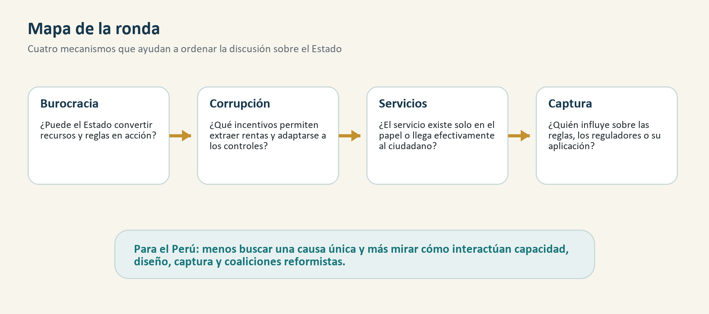

# Ronda 2: ¿Por qué el Estado llega tarde, mal o no llega?

## Para abrir la conversación

La capacidad estatal no se mide solamente por el tamaño del presupuesto, el
número de funcionarios o la cantidad de normas. Un Estado capaz convierte
recursos, autoridad e información en resultados: recauda, coordina, ejecuta,
regula, fiscaliza y entrega servicios. Esta ronda reúne cuatro trabajos que
permiten distinguir capacidad burocrática, corrupción, provisión efectiva de
servicios y captura regulatoria.

La conclusión de partida es deliberadamente abierta. Los problemas del Estado
peruano difícilmente responden a una sola causa. Pueden coexistir restricciones
presupuestales, mala organización, reglas poco funcionales, interferencia
política, captura por intereses privados o ilegales y falta de apoyo social para
sostener reformas. La literatura ayuda a ordenar estos mecanismos; no reemplaza
el análisis empírico específico del Perú.

## Mapa de la ronda

El mapa resume la intuición de la ronda: el Estado no falla por un solo punto. Puede tener recursos y normas, pero si la burocracia no funciona, si la corrupción adapta sus formas, si el servicio no llega o si la regulación es capturada, el resultado final para el ciudadano sigue siendo débil.

## 1. Burocracia y desarrollo

### La pregunta

¿Qué hace efectiva a una burocracia y cómo se relaciona esa efectividad con el
desarrollo? Besley, Burgess, Khan y Xu revisan una literatura reciente que usa
datos administrativos y experimentos de campo para estudiar el funcionamiento
interno del Estado. Su aporte consiste en conectar esos estudios
microeconómicos con una pregunta histórica más amplia: cómo se construye la
capacidad estatal.

### Evidencia y argumento

El artículo es una revisión de literatura, no un único experimento. Ordena
evidencia sobre selección y asignación de funcionarios, incentivos, monitoreo,
autonomía y cultura organizacional. También insiste en que el desempeño de una
agencia no depende únicamente de sus reglas internas. Las burocracias forman
parte de sistemas y se relacionan con políticos, ciudadanos, empresas y
organizaciones no gubernamentales.

Esta perspectiva evita dos simplificaciones. La primera es identificar
burocracia con papeleo: una burocracia profesional puede reducir incertidumbre,
coordinar decisiones y dar continuidad a políticas. La segunda es asumir que
una intervención aislada, como un bono o una capacitación, construye por sí
sola capacidad estatal. Los incentivos pueden funcionar de manera distinta
según la información disponible, las tareas encomendadas y el entorno político.

### Qué aporta

El trabajo desplaza la atención desde la existencia formal de instituciones
hacia su funcionamiento. También muestra por qué la reforma del Estado no puede
reducirse a copiar una práctica administrativa: las organizaciones públicas
interactúan entre sí y responden a equilibrios políticos y sociales.

### Límite

Como revisión amplia, el artículo no ofrece una receta única ni estima un efecto
promedio aplicable a todos los países. Su valor está en identificar mecanismos
y preguntas, que luego deben contrastarse en contextos concretos.

## 2. Corrupción en países en desarrollo

### La pregunta

¿Cuánta corrupción existe, qué costos produce y qué determina su nivel? Olken y
Pande revisan una nueva generación de estudios microeconómicos que mejoró la
medición de actividades deliberadamente ocultas.

### Evidencia y argumento

La revisión incluye estrategias como auditorías, comparación entre gastos
reportados y recursos efectivamente utilizados, datos administrativos,
experimentos y mediciones indirectas. Este giro empírico permitió estudiar la
corrupción más allá de índices de percepción o casos judicializados.

Los autores encuentran evidencia sólida de que la corrupción responde a
incentivos económicos. El riesgo de detección, las sanciones y las oportunidades
de apropiación importan. Sin embargo, también observan que el efecto de algunas
políticas anticorrupción se debilita con el tiempo, porque los funcionarios
pueden sustituir un mecanismo de extracción por otro.

### Qué aporta

El resultado obliga a pensar la corrupción como un problema de sistemas. La
investigación y la sanción siguen siendo necesarias, pero pueden resultar
insuficientes si la organización mantiene discrecionalidad opaca, controles
predecibles o canales alternativos para obtener rentas. Una política efectiva
debe considerar adaptación, desplazamiento y costos de monitoreo.

### Límite

Los estudios revisados miden formas concretas de corrupción en contextos
determinados. No toda captura, favoritismo o influencia indebida deja las mismas
huellas, y los resultados de una intervención pueden depender de la capacidad
de la institución que la implementa.

## 3. Cuando el servicio existe solo en el papel

### La pregunta

¿Están realmente disponibles los docentes y trabajadores de salud financiados
por el Estado? Chaudhury y coautores realizaron visitas no anunciadas a escuelas
primarias y establecimientos de salud en Bangladesh, Ecuador, India, Indonesia,
Perú y Uganda.

### Datos y resultados

Los encuestadores registraron si los proveedores se encontraban en el
establecimiento. En el promedio de los seis países, aproximadamente el 19% de
los docentes y el 35% de los trabajadores de salud estaban ausentes durante las
visitas. Los autores advierten que la presencia física tampoco garantiza que el
trabajador esté realizando su tarea; por ello, esas tasas pueden subestimar el
problema de prestación efectiva.

El diseño no es un experimento que identifique una única causa del ausentismo.
Es una medición comparada y directa de una dimensión básica del servicio. El
trabajo analiza correlaciones, incentivos y economía política, y discute
alternativas de política.

### Qué aporta

La distinción entre insumos y servicios es decisiva. Un presupuesto ejecutado,
un local construido o una plaza cubierta pueden registrarse como avances sin
que el ciudadano reciba atención. La supervisión, las condiciones de trabajo,
los incentivos, la información de los usuarios y la posibilidad de exigir
responsabilidad forman parte de la calidad real.

### Límite

La evidencia fue recogida hace más de dos décadas y no debe usarse como una
medición actual del Perú. Su vigencia es conceptual y comparativa: muestra cómo
medir la brecha entre disponibilidad formal y efectiva. Para diagnosticar la
situación presente se requieren datos peruanos recientes y comparables.

## 4. Captura regulatoria

### La pregunta

¿Cómo y por qué un regulador puede terminar favoreciendo a los actores que debe
regular? Dal Bó revisa la literatura teórica y empírica sobre captura, con
énfasis en servicios públicos regulados.

### Mecanismos

El artículo parte de la economía política de la regulación y abre la “caja
negra” de la influencia. Examina modelos de agencia bajo información
asimétrica, lobby informativo, puertas giratorias, presión o coerción,
interferencia sobre comités y métodos de selección de reguladores.

La captura no equivale necesariamente a un pago ilegal. Puede surgir porque el
regulado posee información técnica que el Estado necesita, porque ofrece
perspectivas laborales futuras, porque concentra beneficios mientras los costos
se dispersan entre ciudadanos, o porque influye en quién regula y con qué
recursos.

### Qué aporta

El texto permite distinguir corrupción administrativa y captura regulatoria. La
primera puede buscar una renta individual dentro de una regla; la segunda puede
alterar la regla, la interpretación o la intensidad de su aplicación. La
respuesta institucional debe considerar transparencia, conflictos de interés,
autonomía, capacidades técnicas y mecanismos de nombramiento.

### Límite

Es una revisión de 2006 y buena parte de su énfasis proviene de sectores
regulados y experiencias internacionales. Se conserva como lectura
complementaria por su claridad conceptual, pero una aplicación al Perú requiere
evidencia sectorial y literatura posterior.

## Reflexión para el Perú

### Lo que la literatura permite afirmar

Los cuatro trabajos respaldan una idea general: los recursos y las normas no se
transforman automáticamente en capacidad estatal. Importan las organizaciones,
los incentivos, la información, el monitoreo, las relaciones políticas y la
capacidad de los ciudadanos para observar y reclamar resultados.

También permiten separar problemas que suelen mezclarse. La baja capacidad no
es idéntica a corrupción; el ausentismo no prueba por sí mismo captura; y la
captura puede operar sin una transacción ilegal visible. Distinguir mecanismos
es necesario para elegir respuestas.

### Lo que sugieren, sin demostrarlo, para el Perú

Una hipótesis razonable es que el Perú enfrenta una combinación de:

- capacidades desiguales entre entidades, sectores y territorios;
- fragmentación y dificultades de coordinación entre niveles de gobierno;
- alta rotación y escasa continuidad de equipos y políticas;
- controles que pueden concentrarse en el cumplimiento formal antes que en los resultados;
- capturas diversas, no limitadas a grandes empresas, que pueden incluir redes políticas, proveedores, gremios y economías ilegales;
- una coalición social y política insuficiente para financiar, exigir y proteger reformas de largo plazo.

Esta combinación ayuda a entender por qué aumentar presupuesto, crear una nueva
entidad o aprobar una norma puede producir resultados menores a los esperados.
Pero sigue siendo una hipótesis que debe evaluarse con evidencia peruana por
sector, entidad y territorio.

### Respuesta tentativa

El principal problema no parece ser una elección entre recursos, gestión,
diseño institucional, captura o apoyo político. Es la interacción entre ellos.
Una entidad con pocos recursos puede fallar por restricción material; una con
recursos puede fallar por mala organización; una bien organizada puede perder
efectividad por interferencia o captura; y una reforma técnicamente adecuada
puede desaparecer si no cuenta con respaldo político y social.

Fortalecer el Estado peruano exige, por tanto, combinar profesionalización,
mejor información, coordinación, controles orientados a riesgos y resultados,
prevención de conflictos de interés y mecanismos de rendición de cuentas. La
pregunta no es solamente qué reforma funciona, sino qué condiciones permiten
sostenerla y extenderla en un territorio heterogéneo.

## Preguntas para discutir

1. ¿En qué sectores peruanos el problema principal parece ser falta de capacidad y en cuáles captura o interferencia?
2. ¿Los controles actuales premian resultados o principalmente el cumplimiento de procedimientos?
3. ¿Qué reformas podrían sobrevivir a la rotación de autoridades y funcionarios?
4. ¿Qué actores sociales estarían dispuestos a financiar y defender un Estado más capaz?

## Áreas económicas

Economía del desarrollo; economía pública; economía política; economía
institucional; economía de la regulación; economía organizacional; economía
laboral del sector público; economía de la educación; economía de la salud y
microeconomía aplicada.

**Códigos JEL orientativos:** D72, D73, H11, H41, H75, H83, I18, I28, K23,
L51, O17 y O43.

## Bibliografía

Besley, T., Burgess, R., Khan, A., & Xu, G. (2022). Bureaucracy and
development. *Annual Review of Economics, 14*, 397-424.
https://doi.org/10.1146/annurev-economics-080521-011950

Chaudhury, N., Hammer, J., Kremer, M., Muralidharan, K., & Rogers, F. H.
(2006). Missing in action: Teacher and health worker absence in developing
countries. *Journal of Economic Perspectives, 20*(1), 91-116.
https://doi.org/10.1257/089533006776526058

Dal Bó, E. (2006). Regulatory capture: A review. *Oxford Review of Economic
Policy, 22*(2), 203-225. https://doi.org/10.1093/oxrep/grj013

Olken, B. A., & Pande, R. (2012). Corruption in developing countries. *Annual
Review of Economics, 4*, 479-509.
https://doi.org/10.1146/annurev-economics-080511-110917

## Nota editorial

Los metadatos bibliográficos y DOI fueron contrastados con Crossref y las
páginas de las publicaciones. Los resúmenes se basan en los argumentos y
resultados declarados por los artículos. La evidencia de Chaudhury et al.
incluye al Perú, pero corresponde al periodo de estudio original y no representa
una medición actual. Las implicancias peruanas se presentan expresamente como
hipótesis para orientar discusión e investigación adicional.

Este documento fue preparado con asistencia de Codex, de OpenAI, para organizar
el material, verificar metadatos bibliográficos y apoyar la redacción. La
selección de lecturas, el enfoque interpretativo y cualquier decisión de
publicación quedan bajo responsabilidad editorial del proyecto.
