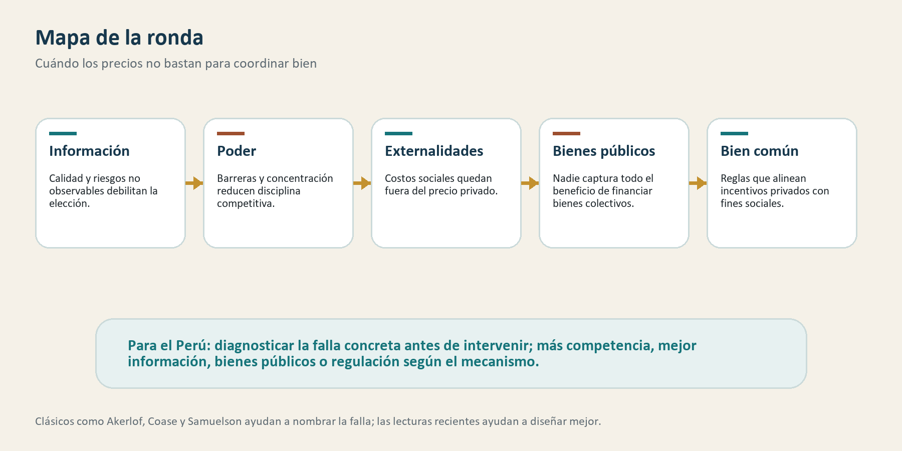

# Ronda 3: ¿Cuándo los mercados no bastan?

## Para abrir la conversación

La primera ronda partía de una idea: los buenos mercados no aparecen solos.
Necesitan Estado capaz, reglas, información, competencia, derechos,
infraestructura y confianza. La segunda ronda, todavía interna, mira el otro
lado del problema: el Estado también puede fallar por baja capacidad,
corrupción, burocracia deficiente o captura.

Esta tercera ronda cierra el primer arco preguntando por las fallas del otro
instrumento central: los mercados. No para negar su importancia, sino para
entender cuándo dejan de coordinar bien y qué tipo de intervención pública
puede ayudar.

El punto no es decir “el mercado falla, entonces el Estado debe reemplazarlo”.
Esa conclusión sería demasiado rápida. La intervención pública también puede
fallar. La pregunta útil es más precisa: qué falla, por qué falla, cómo afecta
el funcionamiento del mercado y qué arreglo institucional puede corregir el
problema sin crear uno mayor.

## Mapa de la ronda

La discusión se organiza alrededor de cinco ideas:

- la información imperfecta puede hacer que elegir no baste para disciplinar calidad;
- el poder de mercado puede debilitar competencia, salarios, inversión y dinamismo;
- las externalidades hacen que el precio privado no refleje costos sociales;
- los bienes públicos se subproducen cuando nadie captura todo el beneficio;
- los mercados necesitan reglas orientadas al bien común, no solo eficiencia privada.

Antes de entrar a las lecturas, conviene ubicar dos clásicos. **Akerlof** mostró
que, cuando la calidad no se observa, los malos productos pueden desplazar a
los buenos. Eso afecta al mercado porque reduce confianza, castiga a los
proveedores de calidad y puede achicar transacciones valiosas. **Coase** mostró
que las externalidades dependen de derechos, negociación y costos de
transacción. Eso afecta al mercado porque una transacción privada puede imponer
costos sobre terceros que no participan en el precio ni en el contrato.

## 1. Información imperfecta: cuando la elección no alcanza

*Frictions or Mental Gaps: What's Behind the Information We (Don't) Use and When Do We Care?* — Handel y Schwartzstein (2018)

### La pregunta

¿Por qué las personas toman malas decisiones incluso cuando existe información
disponible? Handel y Schwartzstein revisan una literatura que va más allá de la
asimetría informativa clásica: no basta preguntar si la información existe,
sino si las personas pueden encontrarla, procesarla y usarla bien.

### Evidencia y argumento

El artículo distingue entre fricciones y brechas mentales. Las fricciones
incluyen costos de búsqueda, costos de cambio, dificultad para comparar
productos o complejidad contractual. Las brechas mentales incluyen atención
limitada, creencias equivocadas, sesgos, falta de saliencia o modelos
incorrectos sobre cómo funciona un producto.

El aporte es importante porque actualiza el problema clásico de Akerlof. En
*The Market for Lemons*, si el comprador no puede observar calidad, el precio
refleja calidad promedio. Los vendedores buenos no reciben el valor que
merecen, salen del mercado o reducen calidad. El resultado perjudica al mercado:
menos confianza, menos transacciones buenas y persistencia de productos malos.

Handel y Schwartzstein muestran que incluso cuando hay información, el problema
puede persistir. Si comparar planes de salud, créditos, pensiones, colegios o
seguros es costoso o cognitivamente difícil, la competencia no disciplina
suficientemente. Las empresas pueden competir en dimensiones visibles y
esconder costos, riesgos o baja calidad en dimensiones menos observables.

Esto cambia la política pública. Si el problema es falta de información, puede
ayudar publicar datos. Si el problema es procesamiento, quizá se necesiten
estándares, comparadores simples, certificación, defaults, reglas contra
cláusulas abusivas o mecanismos de reclamo.

### Qué aporta

Para el Perú, esta lectura ayuda a pensar mercados donde la calidad es difícil
de observar: educación privada, salud, crédito informal, capacitación laboral,
alquileres, construcción, transporte, servicios profesionales y productos
financieros. En esos mercados, más opciones no garantizan mejores decisiones si
los usuarios no pueden distinguir calidad o riesgos.

La lectura también muestra por qué proteger al consumidor no es una agenda
contraria al mercado. Puede ser una condición para que el mercado funcione
mejor. Si la información es comprensible y verificable, los proveedores buenos
tienen más incentivos para invertir en calidad.

### Límite

El texto no dice qué instrumento específico debe usarse en cada mercado. Una
mala regulación informativa puede producir papeleo sin mejorar decisiones. Para
aplicarlo al Perú, habría que identificar si el problema dominante es falta de
datos, dificultad de comparación, sesgos, baja fiscalización o ausencia de
alternativas reales.

## 2. Poder de mercado: cuando competir no es tan fácil

*Macroeconomics and Market Power: Context, Implications, and Open Questions* — Syverson (2019)

### La pregunta

¿Está aumentando el poder de mercado y qué implicancias tiene para la economía?
Syverson revisa el debate sobre concentración, markups, participación laboral,
inversión y dinamismo empresarial.

### Evidencia y argumento

La revisión parte de una cautela: poder de mercado no es lo mismo que tamaño.
Una empresa grande puede ser eficiente, innovadora o producir a menor costo.
Pero también puede tener poder si enfrenta poca competencia, controla datos,
redes, permisos, insumos, distribución o barreras de entrada.

Syverson muestra que medir poder de mercado es difícil. La concentración
nacional puede ocultar competencia local; la concentración local puede importar
aunque los datos agregados no la muestren. Los markups requieren estimar costos
marginales, algo empíricamente complejo. Aun así, el debate importa porque el
poder de mercado puede afectar precios, calidad, salarios, inversión,
innovación y entrada de nuevas firmas.

Aquí se conecta con evidencia empírica como la de De Loecker, Eeckhout y Unger,
quienes documentan aumento de markups en Estados Unidos desde 1980 y discuten
posibles implicancias macroeconómicas. La lectura prudente no es copiar ese
resultado al Perú, sino usar la pregunta: ¿dónde la competencia disciplina y
dónde solo parece existir?

### Qué aporta

Para el Perú, este enfoque permite mirar mercados nacionales y locales con más
cuidado. Puede haber sectores con muchas transacciones pero poca competencia
efectiva por barreras de entrada, informalidad selectiva, permisos, control de
canales, escala mínima, financiamiento, datos o redes políticas.

También ayuda a diferenciar productividad de renta. Una firma puede ganar más
porque innovó, redujo costos y sirve mejor. Otra puede ganar más porque bloquea
entrada, captura reglas o aprovecha baja fiscalización. La política pública
debe proteger competencia, no castigar tamaño por sí mismo.

### Límite

La literatura sobre poder de mercado es empíricamente exigente. No basta mirar
concentración o precios altos para concluir abuso. Se necesita evidencia sobre
costos, entrada, sustitutos, calidad, márgenes, regulación y mercado relevante.
En Perú, esa evidencia suele ser incompleta, especialmente en mercados locales
o informales.

## 3. Externalidades: cuando el precio no recoge todos los costos

*Envirodevonomics: A Research Agenda for an Emerging Field* — Greenstone y Jack (2015)

### La pregunta

¿Cómo pensar los problemas ambientales en países en desarrollo? Greenstone y
Jack proponen unir economía ambiental y economía del desarrollo para estudiar
contaminación, salud, productividad, instituciones y política pública.

### Evidencia y argumento

Las externalidades ocurren cuando una decisión privada genera costos o
beneficios sobre terceros que no se reflejan plenamente en el precio. Coase
ayuda a entender por qué esto afecta al mercado: si los derechos no están
claros o negociar es costoso, quien contamina puede no pagar el daño y quien
lo sufre no puede hacerlo valer. El precio privado subestima el costo social.

Greenstone y Jack muestran que, en países en desarrollo, el problema ambiental
no puede analizarse solo como preferencia por aire limpio. Hay restricciones de
ingreso, baja capacidad de monitoreo, derechos débiles, información incompleta,
costos de cumplimiento, corrupción y conflictos distributivos.

La mala calidad ambiental puede reducir salud y productividad. Pero aun si los
costos sociales son altos, las políticas pueden fallar si no hay medición,
fiscalización, sanción, compensación o legitimidad territorial. La externalidad
es económica, pero su corrección es institucional.

### Qué aporta

Para el Perú, esta lectura es directa. Minería formal e informal, contaminación
de ríos, deforestación, aire urbano, residuos, congestión, uso de suelo y
conflictos territoriales son problemas donde los costos no siempre recaen sobre
quien decide.

La lectura evita dos simplificaciones. No toda actividad privada incorpora sus
costos sociales. Pero tampoco toda regulación ambiental funciona por el simple
hecho de existir. Se necesitan datos, monitoreo, derechos claros, autoridad y
mecanismos de reparación.

### Límite

La revisión ofrece una agenda de investigación, no una receta para cada
conflicto peruano. Para aplicarla se necesita evidencia local sobre daños,
costos, capacidades de fiscalización, distribución de beneficios y legitimidad
de las instituciones.

## 4. Bienes públicos: cuando nadie captura todo el beneficio

*Global Public Goods: A Survey* — Buchholz y Sandler (2021)

### La pregunta

¿Por qué algunos bienes socialmente valiosos se subproducen incluso cuando sus
beneficios son enormes? Buchholz y Sandler revisan la literatura sobre bienes
públicos globales: bienes cuyos beneficios cruzan fronteras, generaciones o
grupos amplios, y que por eso requieren cooperación más allá de una transacción
privada simple.

### Evidencia y argumento

La referencia clásica es Samuelson. En *The Pure Theory of Public Expenditure*,
un bien público puro es no rival y no excluible: el consumo de una persona no
reduce el de otra y excluir beneficiarios es difícil. El problema económico es
el free riding. Si una persona puede beneficiarse sin pagar, espera que otros
financien el bien. Si muchos hacen lo mismo, el bien se produce poco, tarde o
mal.

Buchholz y Sandler actualizan esa intuición en una escala más realista. Muchos
bienes públicos relevantes no son puramente nacionales: estabilidad climática,
salud global, conocimiento científico, seguridad internacional, estabilidad
financiera, biodiversidad, datos abiertos o prevención de pandemias. El mercado
se perjudica porque el retorno privado apropiable es menor que el retorno
social, y porque ningún actor individual tiene incentivos suficientes para
financiar todo el beneficio colectivo.

La revisión también muestra que no todos los bienes públicos globales se
proveen igual. Algunos dependen del esfuerzo agregado de muchos países; otros,
del eslabón más débil; otros, de un actor líder; otros, de estándares, redes o
clubes. El diseño institucional importa: financiamiento, monitoreo, sanciones,
reputación, acuerdos internacionales y distribución de costos modifican la
posibilidad de cooperación.

En desarrollo productivo, el mismo mecanismo aparece en escala nacional o
sectorial. Estándares, laboratorios, certificaciones, reputación exportadora,
formación técnica, información de mercados, datos públicos o prevención de
desastres pueden beneficiar a muchas firmas sin que una sola capture todo el
retorno. Si nadie coordina, cada actor invierte menos de lo socialmente
deseable.

### Qué aporta

Para el Perú, esta lectura ayuda a entender por qué algunos problemas no se
resuelven solo con emprendimiento individual. Muchas brechas productivas y
territoriales requieren bienes colectivos: seguridad, conectividad, información,
calidad regulatoria, infraestructura, prevención y confianza.

También ayuda a ordenar la discusión sobre Estado. El Estado no interviene solo
para reemplazar al mercado. A veces interviene para producir condiciones que
hacen posibles mejores mercados.

La dimensión global es especialmente útil para pensar problemas como cambio
climático, Amazonía, vigilancia sanitaria, conocimiento técnico, crimen
transnacional, estabilidad financiera o estándares de comercio. El Perú puede
beneficiarse de bienes públicos que no produce solo, pero también puede quedar
expuesto cuando la cooperación internacional falla. Por eso la agenda de bienes
públicos no es solo doméstica: también es diplomática, regional y multilateral.

### Límite

Buchholz y Sandler ofrecen una revisión amplia, no una receta para cada bien
público. El hecho de que un bien tenga beneficios colectivos no define
automáticamente quién debe financiarlo, qué nivel de gobierno debe proveerlo,
cómo evitar captura, cómo repartir costos ni cómo rendir cuentas. Para aplicarlo
al Perú se necesita combinar teoría de bienes públicos, economía política,
capacidad estatal y cooperación internacional.

## 5. Mercados, regulación y bien común

*Economics for the Common Good* — Tirole (2017)

### La pregunta

¿Cómo puede la economía contribuir al bien común sin reducir la vida pública a
precios y eficiencia? Tirole ofrece una discusión amplia sobre mercados,
regulación, incentivos, expertos, moralidad y fines sociales.

### Evidencia y argumento

Tirole no trata a los mercados como moralmente autosuficientes ni como
inevitablemente dañinos. Los entiende como instrumentos poderosos que requieren
reglas. La pregunta no es si debe haber mercado o Estado en abstracto, sino
cómo diseñar instituciones para que los incentivos privados se alineen con
objetivos sociales.

La regulación, en esta mirada, no es solo prohibición. Puede ser diseño de
subastas, estándares, transparencia, competencia, reglas de acceso, protección
de usuarios, separación de funciones o incentivos a innovación. Regular bien
exige entender información asimétrica, poder de mercado, comportamiento
estratégico y riesgo de captura.

La dimensión ética es central. Salud, educación, justicia, ambiente, seguridad,
privacidad y dignidad no se agotan en disposición de pago. La economía puede
mostrar costos, incentivos y efectos no deseados, pero no decide por sí sola
qué bienes deben tratarse como derechos ni qué desigualdades son aceptables.

### Qué aporta

Tirole permite conectar esta ronda con el marco cívico del proyecto. Los
mercados son instrumentos para una sociedad de ciudadanos, no fines últimos.
Cuando funcionan bien, amplían opciones, innovación y cooperación. Cuando
fallan, pueden producir abuso, exclusión, daño ambiental o pérdida de
confianza.

Para el Perú, esto sugiere discutir regulación con menos reflejo ideológico:
ni toda regla es progreso ni toda desregulación es libertad. La pregunta es qué
regla alinea mejor incentivos privados con fines públicos, bajo capacidad
estatal real.

### Límite

El libro es amplio y no ofrece un estudio empírico específico sobre el Perú.
Su aporte está en articular economía, ética e instituciones. Para convertirlo
en política pública se requiere evidencia sectorial y diseño regulatorio
concreto.

## Reflexión para el Perú

### Lo que la literatura permite afirmar

Estas lecturas respaldan una idea común: los mercados pueden fallar por
información imperfecta, poder de mercado, externalidades, bienes públicos y
límites éticos. En esos casos, el precio privado puede dejar de reflejar calidad,
costos sociales, beneficios colectivos o poder de negociación.

Pero la literatura también advierte que la intervención pública no corrige
automáticamente esos problemas. Regular exige información, capacidad,
legitimidad, fiscalización y protección contra captura.

### Lo que sugieren para el Perú

Una hipótesis razonable es que muchos mercados peruanos funcionan en una zona
intermedia: no son mercados competitivos ideales, pero tampoco espacios que el
Estado pueda corregir fácilmente. Hay baja confianza, información incompleta,
heterogeneidad territorial, informalidad, externalidades ambientales y
capacidad estatal desigual.

Esto vuelve insuficiente la pregunta “¿más mercado o más Estado?”. Una pregunta
mejor sería: ¿qué falla concreta observamos y qué institución tiene más
capacidad para corregirla?

### Respuesta tentativa

El Perú necesita mercados más competitivos, pero también más confiables; más
iniciativa privada, pero con mejores reglas; más regulación donde hay daño o
abuso, pero con más capacidad estatal y menos captura. La discusión seria no es
Estado contra mercado. Es diagnóstico institucional: información, competencia,
externalidades, bienes públicos y bien común.

## Preguntas para discutir

1. ¿Qué mercados peruanos funcionan mal porque la calidad no se observa?
2. ¿Dónde hay poder de mercado y dónde solo hay empresas grandes pero eficientes?
3. ¿Qué externalidades ambientales o territoriales están peor medidas?
4. ¿Qué bienes públicos productivos son más urgentes para el desarrollo regional?
5. ¿Qué regulación puede corregir una falla sin convertirse en captura?
6. ¿Qué evidencia local necesitamos antes de intervenir?

## Áreas económicas

Organización industrial; economía pública; economía de la información;
economía ambiental; economía del desarrollo; economía de la regulación;
economía política; bienestar social.

**Códigos JEL orientativos:** D42, D43, D62, D82, H41, I18, K21, L13, L40,
L51, O12, Q52 y Q58.

## Bibliografía

Akerlof, G. A. (1970). The market for "lemons": Quality uncertainty and the
market mechanism. *Quarterly Journal of Economics, 84*(3), 488-500.
https://doi.org/10.2307/1879431

Buchholz, W., & Sandler, T. (2021). Global public goods: A survey. *Journal of
Economic Literature, 59*(2), 488-545. https://doi.org/10.1257/jel.20191546

Coase, R. H. (1960). The problem of social cost. *Journal of Law and Economics,
3*, 1-44. https://doi.org/10.1086/466560

De Loecker, J., Eeckhout, J., & Unger, G. (2020). The rise of market power and
the macroeconomic implications. *Quarterly Journal of Economics, 135*(2),
561-644. https://doi.org/10.1093/qje/qjz041

Greenstone, M., & Jack, B. K. (2015). Envirodevonomics: A research agenda for
an emerging field. *Journal of Economic Literature, 53*(1), 5-42.
https://doi.org/10.1257/jel.53.1.5

Handel, B. R., & Schwartzstein, J. (2018). Frictions or mental gaps: What's
behind the information we (don't) use and when do we care? *Journal of Economic
Perspectives, 32*(1), 155-178. https://doi.org/10.1257/jep.32.1.155

Samuelson, P. A. (1954). The pure theory of public expenditure. *Review of
Economics and Statistics, 36*(4), 387-389. https://doi.org/10.2307/1925895

Syverson, C. (2019). Macroeconomics and market power: Context, implications,
and open questions. *Journal of Economic Perspectives, 33*(3), 23-43.
https://doi.org/10.1257/jep.33.3.23

Tirole, J. (2017). *Economics for the common good*. Princeton University Press.

## Nota editorial

Esta ronda usa los clásicos como referencias conceptuales rápidas y las
lecturas recientes como base de discusión principal. Las inferencias para el
Perú deben leerse como hipótesis de trabajo, no como resultados directamente
probados por estudios realizados en otros contextos.
