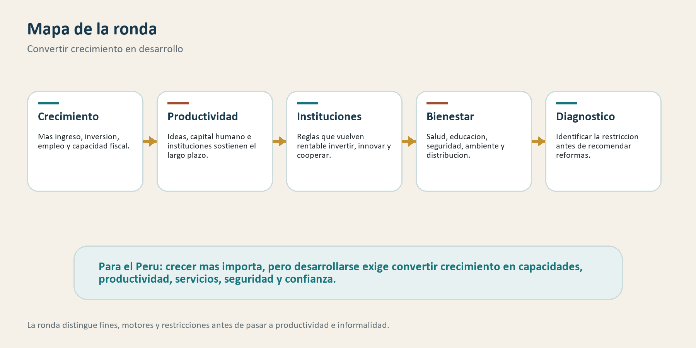

# Ronda 4: ¿Por qué crecer no siempre equivale a desarrollarse?

## Para abrir la conversación

Las primeras rondas ordenaron una discusión básica: buenos mercados necesitan
Estado capaz; el Estado también puede fallar; y los mercados tampoco bastan
cuando hay información imperfecta, poder, externalidades o bienes públicos. La
pregunta que sigue es más amplia: ¿qué significa desarrollar un país?

El crecimiento económico es indispensable. Sin crecimiento, es más difícil
elevar ingresos, financiar servicios, crear empleo, invertir en infraestructura
o sostener protección social. Pero crecer no equivale automáticamente a
desarrollarse. Un país puede aumentar su PBI y, al mismo tiempo, mantener baja
productividad, servicios deficientes, inseguridad, desigualdad persistente,
territorios desconectados o instituciones frágiles.

Esta ronda propone separar tres planos. El primero es el crecimiento: producir
más valor por persona. El segundo es la conversión de ese crecimiento en
capacidades: salud, educación, seguridad, tiempo, derechos, movilidad y
oportunidades. El tercero es la sostenibilidad institucional y social: que las
mejoras no dependan solo de un ciclo favorable, sino de reglas, aprendizaje,
confianza y productividad.

## Mapa de la ronda

La discusión se organiza alrededor de cinco ideas:

- crecer importa porque amplía ingreso, inversión, empleo y capacidad fiscal;
- el crecimiento moderno depende de ideas, productividad, capital humano e instituciones;
- el desarrollo exige convertir crecimiento en libertad, capacidades y bienestar;
- las instituciones moldean incentivos para invertir, innovar y cooperar;
- medir progreso requiere mirar bienestar y sostenibilidad, no solo PBI;
- las políticas de crecimiento deben partir de un diagnóstico de restricciones.

Jones y Romer ayudan a actualizar los hechos estilizados del crecimiento:
ideas, instituciones, población y capital humano importan para explicar el
crecimiento moderno. Jones desarrolla después una revisión más amplia de esos
hechos y de sus preguntas abiertas. Sen, Stiglitz y Fitoussi recuerdan que el
objetivo final no es maximizar una estadística, sino ampliar posibilidades de
vida. Hausmann, Rodrik y Velasco conectan esa discusión con una advertencia de
política: antes de recomendar reformas, hay que identificar qué restricción
limita el crecimiento en cada contexto.

## 1. Por qué importa crecer: ideas, productividad e instituciones

*The Facts of Economic Growth* — Jones (2016)

### La pregunta

¿Qué hechos debe explicar una teoría moderna del crecimiento? Jones revisa las
regularidades más importantes: grandes diferencias de ingreso entre países,
crecimiento sostenido en la frontera tecnológica, divergencias persistentes,
papel de ideas, capital humano, población, instituciones y productividad total
de factores.

### Evidencia y argumento

Jones parte de una observación poderosa: las diferencias de ingreso por persona
entre países son enormes y tienen consecuencias profundas sobre bienestar. Una
teoría de crecimiento debe explicar por qué algunos países sostienen aumentos de
productividad durante largos periodos y por qué otros no logran converger.

En esta sección conviene leer a Jones junto con Jones y Romer (2010). En *The
New Kaldor Facts*, Jones y Romer sostienen que los hechos clásicos de Kaldor
deben ampliarse. El crecimiento moderno no puede explicarse solo por capital
físico, trabajo y tasas relativamente estables. Hay que incorporar ideas,
instituciones, población, capital humano y diferencias internacionales.

Jones (2016) desarrolla esa agenda con más amplitud. Las ideas tienen una
propiedad especial: pueden usarse repetidamente y generar rendimientos sociales
mayores que los privados. El capital humano permite producir y usar ideas. Las
instituciones influyen sobre incentivos para innovar, invertir y difundir
conocimiento. La productividad total de factores resume mucho más que
tecnología: también refleja organización, asignación de recursos, calidad
institucional y capacidad de aprender.

### Qué aporta

Para el Perú, esta lectura sugiere que crecer sostenidamente no es solo acumular
capital o aprovechar precios externos. Importa elevar productividad, difundir
conocimiento, mejorar asignación de recursos, formar capital humano y construir
instituciones que permitan inversión e innovación.

También evita un malentendido: preocuparse por el crecimiento no es una obsesión
tecnocrática. Sin crecimiento sostenido es más difícil financiar servicios,
crear empleo, reducir pobreza y ampliar oportunidades, especialmente para los
más vulnerables.

### Límite

Jones ofrece hechos y marcos generales, no un diagnóstico específico del Perú.
La literatura de crecimiento puede volverse demasiado agregada si no se conecta
con sectores, territorios, informalidad, empresas y capacidades estatales. Por
eso la inferencia peruana debe pasar por evidencia local.

## 2. Crecer para desarrollar: libertad y capacidades

*Development as Freedom* — Sen (1999)

### La pregunta

¿Qué significa desarrollar una sociedad? Sen responde que el desarrollo debe
entenderse como expansión de libertades reales. El ingreso importa, pero no es
el fin último. Lo que importa es si las personas pueden vivir más y mejor,
aprender, participar, evitar privaciones evitables y elegir una vida que valoran.

### Evidencia y argumento

El argumento de Sen es conceptual e institucional. Critica una visión demasiado
estrecha que equipara desarrollo con crecimiento del ingreso o industrialización.
Para él, la pobreza no es solo bajo ingreso: también es privación de capacidades.
Una persona puede tener más ingreso y seguir sin acceso real a salud, educación,
seguridad, derechos o participación.

La libertad cumple dos roles. Es fin del desarrollo, porque una sociedad más
desarrollada amplía las capacidades de sus miembros. Y es medio del desarrollo,
porque educación, salud, derechos, transparencia, participación y protección
social mejoran la capacidad de las personas para actuar, invertir, reclamar y
cooperar.

Esto no niega el crecimiento. Al contrario, lo ubica dentro de una pregunta más
exigente: ¿crecimiento para qué? Si el crecimiento aumenta ingresos pero no
mejora capacidades básicas, su efecto sobre desarrollo será incompleto. Si
amplía oportunidades, reduce vulnerabilidades y fortalece agencia, entonces se
convierte en desarrollo.

### Qué aporta

Para el Perú, Sen ayuda a evitar una discusión reducida a PBI. Crecer importa,
pero la pregunta es cuánto de ese crecimiento se traduce en salud efectiva,
educación de calidad, seguridad, infraestructura, movilidad, derechos y
capacidad de participar en la vida económica y pública.

También ayuda a conectar economía con ciudadanía. Desarrollo no es solo más
producción; es una sociedad donde más personas tienen opciones reales y no solo
supervivencia.

### Límite

El enfoque de capacidades no ofrece por sí solo una estrategia de crecimiento.
Puede orientar fines, pero necesita complementarse con teorías sobre
productividad, inversión, instituciones y cambio estructural. Para aplicar esta
mirada al Perú se requiere medir capacidades concretas, no solo invocarlas.

## 3. Instituciones: reglas que hacen sostenible la inversión

*Institutions as a Fundamental Cause of Long-Run Growth* — Acemoglu, Johnson y Robinson (2005)

### La pregunta

¿Por qué las instituciones importan para el crecimiento de largo plazo?
Acemoglu, Johnson y Robinson sostienen que las instituciones económicas y
políticas moldean incentivos para invertir, innovar, educarse, comerciar y
producir.

### Evidencia y argumento

El capítulo organiza una literatura amplia sobre instituciones y desempeño
económico. La idea central es que las reglas no son neutrales. Derechos de
propiedad, límites al poder, cumplimiento de contratos, competencia, acceso a
oportunidades y distribución del poder político afectan si los actores invierten
en actividades productivas o en capturar rentas.

Las instituciones económicas determinan incentivos inmediatos: quién puede
invertir, apropiarse de retornos, competir o innovar. Las instituciones
políticas influyen sobre quién decide esas reglas y si los grupos con poder
pueden bloquear cambios que afectarían sus rentas.

El argumento no dice que instituciones buenas aparezcan por diseño técnico. La
distribución de poder importa. Grupos que se benefician del orden existente
pueden resistir reformas aunque el país gane en conjunto. Por eso el
crecimiento sostenido tiene una dimensión política.

### Qué aporta

Para el Perú, esta lectura ayuda a preguntar por qué algunas mejoras no se
sostienen. No basta tener oportunidades de inversión si las reglas son
inciertas, si la justicia no protege derechos, si la competencia es débil o si
la política bloquea reformas que ampliarían productividad.

También conecta con el arco inicial: ni Estado ni mercado funcionan en el vacío.
Ambos necesitan reglas creíbles y mecanismos que limiten abuso de poder público
y privado.

### Límite

La tesis institucional es amplia y puede volverse demasiado general. Decir "las
instituciones importan" no identifica qué institución específica limita el
crecimiento en un sector o territorio. Para política pública se necesita bajar a
mecanismos: justicia, permisos, regulación, corrupción, competencia, derechos de
propiedad, capacidad local o estabilidad de reglas.

## 4. Medir progreso: lo que el PBI no alcanza a mostrar

*Report by the Commission on the Measurement of Economic Performance and Social Progress* — Stiglitz, Sen y Fitoussi (2009)

### La pregunta

¿Qué perdemos cuando usamos el PBI como medida principal de progreso? Stiglitz,
Sen y Fitoussi argumentan que el PBI mide producción de mercado, pero no resume
bienestar, distribución, sostenibilidad ni calidad de vida.

### Evidencia y argumento

El reporte no propone abandonar el PBI. Propone ponerlo en su lugar. El PBI es
útil para medir actividad económica agregada, pero puede ocultar cambios en
ingresos de los hogares, desigualdad, salud, educación, inseguridad económica,
tiempo disponible, calidad ambiental, endeudamiento, vulnerabilidad y
sostenibilidad.

Una economía puede crecer mientras aumentan riesgos ambientales, se deteriora
la calidad de servicios o los beneficios se concentran. También puede haber
mejoras de bienestar que el PBI capta mal: salud preventiva, seguridad, tiempo,
cuidado, confianza o reducción de vulnerabilidad.

El reporte propone mirar bienestar material de los hogares, distribución,
calidad de vida y sostenibilidad. Esto cambia la conversación pública: no basta
preguntar cuánto crece la economía, sino cómo viven las personas y si el avance
puede sostenerse.

### Qué aporta

Para el Perú, esta lectura ayuda a discutir crecimiento sin caer en dos
errores: despreciar el PBI o idolatrarlo. El PBI importa, pero debe acompañarse
de indicadores de empleo, ingresos reales, desigualdad, servicios, seguridad,
ambiente, informalidad, salud, educación y confianza.

También obliga a mirar territorios. Un promedio nacional puede ocultar regiones
que no convierten crecimiento en capacidades o que cargan costos ambientales y
sociales.

### Límite

Medir más dimensiones no resuelve automáticamente prioridades. Puede haber
trade-offs entre crecimiento, distribución, ambiente y sostenibilidad fiscal.
El reto no es reemplazar un número por muchos números, sino construir criterios
para deliberar mejor.

## 5. Diagnóstico del crecimiento: evitar recetas universales

*Growth Diagnostics* — Hausmann, Rodrik y Velasco (2005)

### La pregunta

¿Cómo elegir políticas de crecimiento cuando los países enfrentan restricciones
distintas? Hausmann, Rodrik y Velasco proponen empezar por identificar el cuello
de botella principal que limita inversión y crecimiento.

### Evidencia y argumento

El enfoque parte de una crítica a las listas universales de reformas. Dos países
pueden crecer poco por razones distintas. Uno puede tener bajo retorno social a
la inversión por mala infraestructura o bajo capital humano. Otro puede tener
altos retornos pero baja apropiabilidad por riesgos, corrupción, inseguridad,
fallas de coordinación o mala protección de derechos. Otro puede estar limitado
por financiamiento caro o escaso.

El diagnóstico de crecimiento funciona como árbol de decisión. La política
debe buscar señales: tasas de retorno, precios sombra, comportamiento de
inversión, sectores que crecen pese a restricciones, costos de financiamiento,
infraestructura, capital humano y riesgos. La reforma prioritaria es la que
relaja la restricción más vinculante, no la que aparece primero en una lista
ideológica.

### Qué aporta

Para el Perú, esta lectura es valiosa porque evita discutir crecimiento como
paquete abstracto. En algunos territorios el problema puede ser seguridad; en
otros, infraestructura; en otros, capital humano; en otros, permisos; en otros,
coordinación productiva; en otros, baja competencia o financiamiento.

El enfoque también conecta con las rondas anteriores: diagnosticar bien exige
mirar Estado, mercados, instituciones, bienes públicos y fallas concretas.

### Límite

El diagnóstico de crecimiento no reemplaza política democrática ni juicio
distributivo. Puede identificar restricciones a la inversión, pero no define por
sí solo qué desigualdades son aceptables, qué territorios priorizar o cómo
repartir costos. Además, diagnosticar mal la restricción principal puede llevar
a reformas inútiles.

## Reflexión para el Perú

### Lo que la literatura permite afirmar

Estas lecturas respaldan una idea común: crecimiento y desarrollo están
relacionados, pero no son lo mismo. El crecimiento amplía recursos; el
desarrollo exige convertirlos en capacidades, bienestar, productividad,
instituciones y oportunidades sostenibles.

También muestran que el crecimiento moderno no se sostiene solo con capital
físico. Ideas, capital humano, productividad, instituciones, medición de
bienestar y diagnóstico de restricciones son parte del problema.

### Lo que sugiere para el Perú

Una hipótesis razonable es que el Perú ha tenido momentos de crecimiento sin
convertirlos plenamente en capacidades duraderas. La estabilidad macro y los
precios favorables pueden elevar ingresos, pero no garantizan educación de
calidad, seguridad, formalidad, productividad, confianza, servicios efectivos ni
instituciones capaces.

Otra hipótesis es que el país enfrenta restricciones distintas por territorio y
sector. No hay una sola política de crecimiento para todo el Perú. La costa
urbana, la Amazonía, los Andes, las ciudades intermedias, la minería, la
agricultura, los servicios y la economía informal pueden tener cuellos de
botella diferentes.

### Respuesta tentativa

Crecer es indispensable, pero desarrollarse exige convertir crecimiento en
capacidades. Para el Perú, la pregunta no debería ser solo cómo aumentar el PBI,
sino qué crecimiento eleva productividad, reduce vulnerabilidades, mejora
servicios, amplía libertad efectiva y fortalece instituciones. La discusión
seria empieza cuando se conectan fines, motores y restricciones.

## Preguntas para discutir

1. ¿Qué dimensiones de desarrollo peruano mejoraron menos durante los periodos de crecimiento?
2. ¿Qué indicadores deberían acompañar al PBI en la conversación pública?
3. ¿Qué restricciones al crecimiento parecen más fuertes por territorio o sector?
4. ¿Dónde el problema principal es falta de productividad y dónde es mala conversión de crecimiento en bienestar?
5. ¿Qué capacidades son más urgentes para que el crecimiento sea desarrollo?
6. ¿Qué instituciones permiten sostener crecimiento más allá de un ciclo favorable?

## Áreas económicas

Crecimiento económico; economía del desarrollo; economía institucional;
bienestar social; economía pública; capital humano; macroeconomía del
desarrollo; medición del bienestar; economía política.

**Códigos JEL orientativos:** O10, O11, O12, O15, O40, O43, H11, I31, I32, P16.

## Bibliografía

Acemoglu, D., Johnson, S., & Robinson, J. A. (2005). Institutions as a
fundamental cause of long-run growth. In P. Aghion & S. N. Durlauf (Eds.),
*Handbook of Economic Growth, 1A*, 385-472.
https://doi.org/10.1016/S1574-0684(05)01006-3

Hausmann, R., Rodrik, D., & Velasco, A. (2005). Growth diagnostics. John F.
Kennedy School of Government, Harvard University.

Jones, C. I. (2016). The facts of economic growth. In J. B. Taylor & H. Uhlig
(Eds.), *Handbook of Macroeconomics, 2A*, 3-69.
https://doi.org/10.1016/B978-0-444-53540-5.00001-9

Jones, C. I., & Romer, P. M. (2010). The new Kaldor facts: Ideas,
institutions, population, and human capital. *American Economic Journal:
Macroeconomics, 2*(1), 224-245. https://doi.org/10.1257/mac.2.1.224

Sen, A. (1999). *Development as freedom*. Oxford University Press.

Stiglitz, J. E., Sen, A., & Fitoussi, J.-P. (2009). *Report by the Commission on
the Measurement of Economic Performance and Social Progress*.

## Nota editorial

Jones y Romer (2010) se usan como referencia complementaria dentro de la
sección de crecimiento porque ordenan el cambio desde los hechos clásicos hacia
ideas, instituciones, población y capital humano. Jones (2016) funciona como la
revisión principal por su alcance más amplio y actualizado. Las inferencias para
el Perú deben leerse como hipótesis de trabajo, no como resultados directamente
probados por esas lecturas.
