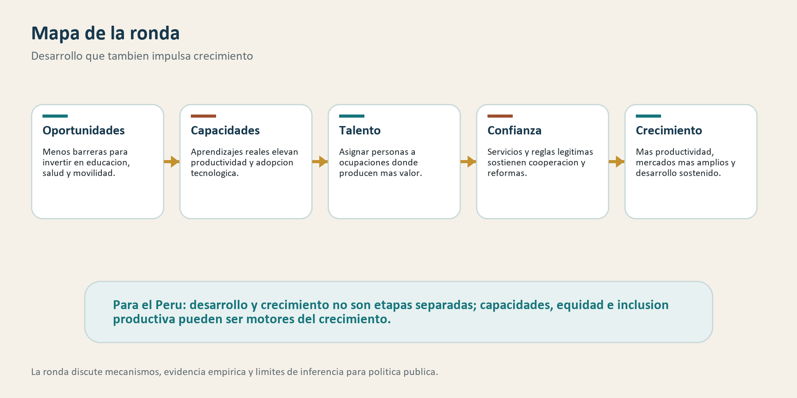

# Ronda 5: ¿El desarrollo debe esperar al crecimiento, o también puede impulsarlo?

## Para abrir la conversación

La ronda anterior sostuvo una idea básica: crecer importa, pero crecer no es lo
mismo que desarrollarse. Sin crecimiento sostenido es difícil elevar ingresos,
financiar servicios, crear empleo y ampliar oportunidades. Pero el desarrollo
no se agota en el PBI. También exige capacidades, bienestar, instituciones,
seguridad, derechos, sostenibilidad y una vida social más plena.

Esta ronda invierte la pregunta. Si el desarrollo no es solo el resultado final
del crecimiento, ¿puede también ser una causa del crecimiento? La respuesta de
buena parte de la literatura moderna es sí, pero con cuidado. Educación de
calidad, salud, igualdad de oportunidades, inclusión de mujeres, movilidad,
seguridad, confianza e instituciones no solo mejoran bienestar. También pueden
elevar productividad, ampliar mercados, mejorar asignación de talento y hacer
más sostenibles las reformas.

La dicotomía “primero crecer, luego distribuir o desarrollar” puede ser
demasiado pobre. Algunas políticas redistributivas mal diseñadas pueden afectar
incentivos, ahorro, inversión o capacidad fiscal. Pero algunas desigualdades
también destruyen crecimiento: bloquean inversión en capital humano, desperdician
talento, reducen confianza, elevan conflicto y limitan la cooperación social. La
pregunta no es si equidad siempre aumenta crecimiento. La pregunta es qué
dimensiones del desarrollo funcionan como insumos de una economía más productiva
y una sociedad más capaz de sostener cambios.

## Mapa de la ronda

La discusión se organiza alrededor de cinco ideas:

- la desigualdad puede afectar crecimiento por restricciones de crédito, capital humano, incentivos y economía política;
- la evidencia empírica reciente sugiere una relación heterogénea, no mecánica, entre desigualdad y crecimiento;
- la calidad del aprendizaje importa más que contar años de escolaridad;
- el empoderamiento de mujeres y la igualdad de oportunidades pueden cambiar decisiones, salud, educación y productividad;
- la asignación del talento es un mecanismo central: excluir personas de ocupaciones productivas reduce crecimiento.

El objetivo es evitar dos errores. El primero es tratar el desarrollo como un
lujo que solo puede financiarse después de crecer. El segundo es suponer que
toda política social genera crecimiento automáticamente. Entre ambos extremos
hay una agenda más útil: identificar qué inversiones en capacidades, servicios,
inclusión y confianza elevan bienestar y, al mismo tiempo, relajan restricciones
al crecimiento.

## 1. Desigualdad y crecimiento: mecanismos antes que consignas

*Inequality and Economic Growth: The Perspective of the New Growth Theories* — Aghion, Caroli y García-Peñalosa (1999)

### La pregunta

¿La desigualdad ayuda o perjudica el crecimiento? Aghion, Caroli y
García-Peñalosa revisan la literatura de nuevas teorías de crecimiento y
muestran que la respuesta depende del mecanismo. La desigualdad puede afectar
capital humano, innovación, incentivos, estabilidad social, redistribución y
economía política.

### Evidencia y argumento

La revisión parte de una ruptura con la visión más simple según la cual la
desigualdad favorece el ahorro y, por tanto, la acumulación de capital. En
economías donde el crecimiento depende cada vez más de capital humano,
innovación y aprendizaje, esa intuición puede fallar. Si los hogares pobres no
pueden financiar educación, salud o emprendimientos productivos, la desigualdad
puede reducir inversión socialmente rentable.

Un canal importante es la restricción de crédito. Cuando los mercados financieros
son imperfectos, el talento no basta. Quien nace con menos recursos puede no
invertir en educación o en proyectos rentables. El resultado no es solo injusto:
también es ineficiente, porque la economía deja de usar capacidades que podrían
elevar productividad.

Otro canal es la economía política. Desigualdad alta puede generar conflicto,
polarización o presión por políticas mal diseñadas. Pero también puede permitir
que grupos con poder bloqueen redistribución eficiente, educación pública,
competencia o reformas que ampliarían oportunidades. Por eso la relación entre
desigualdad y crecimiento no puede leerse como una curva simple.

### Qué aporta

Para el Perú, esta lectura ayuda a formular una pregunta más precisa: ¿qué
desigualdades son especialmente dañinas para el crecimiento? No toda brecha
tiene el mismo mecanismo. Una brecha de ingresos puede afectar consumo y ahorro.
Una brecha educativa afecta productividad futura. Una brecha territorial reduce
acceso a mercados. Una brecha de género puede desperdiciar talento y afectar
decisiones familiares. Una brecha de poder puede bloquear competencia o
capturar reglas.

El aporte es ordenar la discusión. La desigualdad no debe tratarse solo como
problema moral ni como precio inevitable del crecimiento. Puede ser una
restricción económica cuando impide invertir, aprender, competir o cooperar.

### Límite

La revisión no entrega una regla universal. Algunos mecanismos pueden operar en
direcciones distintas según nivel de ingreso, instituciones, estructura
productiva y diseño de políticas. Además, la evidencia empírica sobre
desigualdad y crecimiento es difícil: medición, causalidad, horizonte temporal y
heterogeneidad importan mucho. Por eso conviene complementarla con evidencia
posterior.

## 2. Evidencia reciente: equidad, redistribución y crecimiento sostenido

*Redistribution, Inequality, and Growth: New Evidence* — Berg, Ostry, Tsangarides y Yakhshilikov (2018)

### La pregunta

¿Reducir desigualdad o redistribuir necesariamente perjudica el crecimiento?
Berg, Ostry, Tsangarides y Yakhshilikov revisan evidencia empírica y discuten
una idea importante: la desigualdad puede afectar no solo la tasa de crecimiento,
sino la duración de los episodios de crecimiento.

### Evidencia y argumento

El artículo encuentra que menor desigualdad se asocia con crecimiento más
sostenido. Esto es relevante porque muchos países no fracasan por no crecer
nunca, sino por crecer durante periodos cortos y luego perder impulso. La
desigualdad puede hacer más frágil el crecimiento si reduce cohesión, acceso a
oportunidades, legitimidad de reformas o estabilidad política.

El trabajo también matiza la discusión sobre redistribución. Redistribuir no es
gratis y puede estar mal diseñado. Pero la evidencia que revisan no respalda una
oposición mecánica entre redistribución moderada y crecimiento. En ciertos
contextos, políticas redistributivas razonables pueden reducir desigualdad sin
dañar crecimiento, especialmente si financian capacidades o protección que
mejora participación económica.

Este resultado debe leerse junto con Brückner y Lederman. En *Inequality and
Economic Growth: The Role of Initial Income*, ellos muestran que el efecto de la
desigualdad puede depender del nivel inicial de ingreso. Esto introduce un
matiz útil: el mismo aumento de desigualdad no tiene por qué significar lo mismo
en una economía muy pobre, una de ingreso medio o una avanzada.

### Qué aporta

Para el Perú, la lectura ayuda a salir de una falsa dicotomía. La pregunta no es
“redistribución sí o no”, sino qué tipo de redistribución, financiada cómo,
ejecutada con qué capacidad y orientada a qué capacidades. Transferencias mal
diseñadas pueden tener bajo impacto. Pero educación, salud, seguridad, primera
infancia, infraestructura territorial o inclusión financiera pueden ser
redistributivas y productivas a la vez.

También sugiere evaluar crecimiento por duración y resiliencia. Un país puede
crecer algunos años por precios externos o inversión puntual. La pregunta es si
ese crecimiento crea capacidades, confianza e instituciones que sostengan el
siguiente ciclo.

### Límite

La evidencia agregada no identifica automáticamente qué política conviene para
el Perú. La relación entre desigualdad, redistribución y crecimiento depende de
calidad del gasto, administración tributaria, focalización, universalismo,
informalidad, confianza y capacidad estatal. Una política con buen objetivo
puede fallar si se implementa mal o si no relaja una restricción real.

## 3. Educación: no basta asistir, hay que aprender

*The Role of Cognitive Skills in Economic Development* — Hanushek y Woessmann (2008)

### La pregunta

¿Qué tipo de educación impulsa el desarrollo económico? Hanushek y Woessmann
plantean que los años de escolaridad son una medida incompleta de capital
humano. Lo decisivo para crecimiento son las habilidades efectivas que las
personas adquieren.

### Evidencia y argumento

La literatura tradicional usó años de educación como indicador de capital
humano. Pero dos países con la misma escolaridad promedio pueden tener niveles
muy distintos de aprendizaje. Hanushek y Woessmann muestran que las habilidades
cognitivas medidas por pruebas comparables tienen una relación fuerte con
crecimiento económico.

El argumento es directo. Las economías modernas requieren trabajadores capaces
de resolver problemas, adaptarse, aprender tecnologías, comunicarse, administrar
procesos y participar en organizaciones complejas. Si el sistema educativo
expande matrícula pero no aprendizaje, puede aumentar credenciales sin elevar
productividad.

Esto cambia la discusión sobre desarrollo. Educación no es solo un derecho o un
gasto social; también es infraestructura productiva. Pero su retorno depende de
calidad, pertinencia, continuidad y complementariedades con empleo, empresas,
tecnología e instituciones.

### Qué aporta

Para el Perú, esta lectura es central. El país puede ampliar cobertura y aun así
mantener brechas grandes de aprendizaje. Si muchos estudiantes terminan la
escuela sin habilidades básicas sólidas, la economía enfrenta límites para
innovar, formalizar, adoptar tecnología y elevar productividad.

La inferencia no es culpar a estudiantes o docentes individualmente. La pregunta
es institucional: qué sistema produce aprendizaje, cómo se apoya a docentes,
cómo se mide calidad, cómo se corrigen brechas tempranas y cómo se conectan
habilidades con trayectorias productivas.

### Límite

La relación entre habilidades y crecimiento no resuelve por sí sola el diseño de
política educativa. Medir aprendizaje es necesario, pero no suficiente. Las
reformas educativas requieren capacidad de implementación, legitimidad,
financiamiento, gestión territorial y articulación con salud, nutrición,
familias y mercado laboral.

## 4. Género y desarrollo: una relación de doble vía

*Women Empowerment and Economic Development* — Duflo (2012)

### La pregunta

¿El empoderamiento de las mujeres es consecuencia del desarrollo o puede ser
también causa del desarrollo? Duflo plantea una relación de doble vía: el
desarrollo económico puede mejorar la vida de las mujeres, pero ampliar sus
derechos, educación, ingresos y autonomía también puede afectar resultados de
salud, educación, fertilidad, inversión familiar y productividad.

### Evidencia y argumento

El artículo revisa evidencia sobre cómo los cambios en oportunidades económicas,
educación, poder de decisión y políticas públicas afectan a mujeres y hogares.
Una idea clave es que los hogares no siempre funcionan como una unidad con
preferencias únicas. Quién controla recursos y decisiones puede modificar
inversión en niños, salud, educación y trabajo.

Esto importa para crecimiento porque las barreras de género no solo reducen
bienestar de mujeres. También limitan capital humano, participación laboral,
emprendimiento, asignación de talento y decisiones intergeneracionales. Cuando
una sociedad restringe oportunidades para la mitad de su población, reduce su
propia frontera productiva.

Pero Duflo también advierte contra una visión automática. Desarrollo y
empoderamiento se refuerzan, pero no siempre. Algunas mejoras económicas no
eliminan normas discriminatorias. Algunas políticas pueden tener efectos
limitados si no cambian restricciones de cuidado, violencia, movilidad,
información o derechos.

### Qué aporta

Para el Perú, la lectura permite conectar economía con ciudadanía. Barreras para
mujeres en educación técnica, seguridad, transporte, cuidado, crédito, propiedad
o empleo formal no son solo problemas sectoriales. Pueden reducir productividad
y movilidad social.

También ayuda a pensar política pública de forma integrada. Guarderías, salud
sexual y reproductiva, seguridad, transporte, educación, protección frente a
violencia y acceso financiero pueden afectar bienestar y participación
económica al mismo tiempo.

### Límite

La evidencia sobre género es muy contextual. Una política que mejora resultados
en un país puede no hacerlo en otro si las normas sociales, el mercado laboral,
la seguridad o la capacidad estatal son distintas. Además, no todo debe
justificarse por crecimiento: derechos y libertad importan por sí mismos. El
punto económico complementa, no reemplaza, el argumento cívico.

## 5. Inclusión productiva: asignar mejor el talento

*The Allocation of Talent and U.S. Economic Growth* — Hsieh, Hurst, Jones y Klenow (2019)

### La pregunta

¿Cuánto crecimiento se pierde cuando personas talentosas no acceden a las
ocupaciones donde serían más productivas? Hsieh, Hurst, Jones y Klenow estudian
el caso de Estados Unidos y estiman que la reducción de barreras ocupacionales
para mujeres y personas negras contribuyó de forma importante al crecimiento
del ingreso por persona entre 1960 y 2010.

### Evidencia y argumento

El mecanismo es asignación de talento. Si por discriminación, normas sociales,
restricciones educativas o barreras institucionales ciertos grupos no pueden
entrar a profesiones de alta productividad, la economía asigna mal sus recursos
humanos. Personas con talento terminan en ocupaciones donde producen menos valor
del que podrían producir.

El aporte del artículo es traducir inclusión en productividad agregada. La
igualdad de oportunidades no solo corrige una injusticia. También puede elevar
la eficiencia de la economía al permitir que más personas elijan ocupaciones
según capacidades y no según barreras de origen, género o raza.

Aunque el caso es estadounidense, el mecanismo es general: cuando el acceso a
educación, redes, seguridad, crédito, información o permisos depende demasiado
del origen social, se desperdicia talento.

### Qué aporta

Para el Perú, esta lectura abre una agenda potente. La mala asignación de
talento puede aparecer por territorio, género, calidad educativa, informalidad,
discriminación, inseguridad, redes cerradas, falta de información o barreras de
financiamiento. Un joven talentoso en una escuela débil, una mujer que no puede
moverse segura, un emprendedor sin crédito o un trabajador atrapado en
informalidad no son solo historias individuales: pueden ser pérdidas de
productividad social.

Esto conecta desarrollo con crecimiento de forma directa. Incluir no significa
solo transferir recursos; también significa permitir que capacidades existentes
encuentren usos productivos más altos.

### Límite

El artículo no estima el caso peruano. Sus magnitudes no deben importarse. Lo
que sí puede importarse es el mecanismo: barreras de acceso producen mala
asignación de talento. Para Perú se necesitaría medir movilidad educativa,
trayectorias laborales, brechas salariales, barreras territoriales, retornos a
habilidades y discriminación en mercados concretos.

## Inferencias para pensar el Perú

La ronda sugiere que el desarrollo puede impulsar crecimiento por al menos
cuatro canales. Primero, capacidades: salud, educación y seguridad elevan la
productividad potencial de las personas. Segundo, oportunidades: menos barreras
permiten que talento llegue a ocupaciones y empresas donde produce más valor.
Tercero, confianza: servicios y reglas legítimas hacen más sostenible la
cooperación social y las reformas. Cuarto, demanda y mercados: hogares con más
seguridad y capacidades pueden invertir, consumir, emprender y participar en
mercados más amplios.

Esto no elimina los trade-offs. El Perú necesita crecer más, atraer inversión,
elevar productividad y sostener estabilidad macroeconómica. Pero la pregunta es
qué tipo de crecimiento se busca y qué bases lo hacen sostenible. Si el país
crece con baja calidad educativa, inseguridad, informalidad persistente y
exclusión de talento, el crecimiento será frágil.

La idea práctica es evaluar algunas políticas sociales como inversión en
productividad futura. Primera infancia, aprendizaje escolar, salud preventiva,
seguridad, transporte, cuidado, inclusión financiera, conectividad y protección
frente a violencia pueden tener retornos económicos además de valor social. Pero
para sostener esa afirmación se necesita evidencia: costos, calidad de ejecución,
beneficiarios, impacto y horizonte temporal.

## Preguntas para discutir

- ¿Qué desigualdades en el Perú bloquean más productividad: educación, salud, territorio, género, crédito, seguridad o redes laborales?
- ¿Qué políticas sociales deberían evaluarse también como inversión productiva?
- ¿Cómo distinguir redistribución que amplía capacidades de gasto que solo reparte recursos sin cambiar restricciones?
- ¿Qué evidencia local permitiría medir pérdida de talento por barreras de origen, género o territorio?
- ¿Qué instituciones hacen que desarrollo y crecimiento se refuercen en vez de competir por recursos?

## Áreas económicas y códigos JEL

Áreas económicas: crecimiento económico, economía del desarrollo, desigualdad,
capital humano, economía laboral, economía de la educación, género, economía
política, productividad.

Códigos JEL: O10, O15, O40, I24, I25, J16, J24, D31, D63.

## Bibliografía

Aghion, P., Caroli, E., & García-Peñalosa, C. (1999). Inequality and economic
growth: The perspective of the new growth theories. *Journal of Economic
Literature, 37*(4), 1615-1660. https://doi.org/10.1257/jel.37.4.1615

Berg, A., Ostry, J. D., Tsangarides, C. G., & Yakhshilikov, Y. (2018).
Redistribution, inequality, and growth: New evidence. *Journal of Economic
Growth, 23*, 259-305. https://doi.org/10.1007/s10887-017-9150-2

Brückner, M., & Lederman, D. (2018). Inequality and economic growth: The role of
initial income. *Journal of Economic Growth, 23*, 341-366.
https://doi.org/10.1007/s10887-018-9156-4

Duflo, E. (2012). Women empowerment and economic development. *Journal of
Economic Literature, 50*(4), 1051-1079. https://doi.org/10.1257/jel.50.4.1051

Galor, O., & Zeira, J. (1993). Income distribution and macroeconomics. *The
Review of Economic Studies, 60*(1), 35-52. https://doi.org/10.2307/2297811

Hanushek, E. A., & Woessmann, L. (2008). The role of cognitive skills in
economic development. *Journal of Economic Literature, 46*(3), 607-668.
https://doi.org/10.1257/jel.46.3.607

Hsieh, C.-T., Hurst, E., Jones, C. I., & Klenow, P. J. (2019). The allocation of
talent and U.S. economic growth. *Econometrica, 87*(5), 1439-1474.
https://doi.org/10.3982/ECTA11427

Neves, P. C., Afonso, O., & Silva, S. T. (2016). A meta-analytic reassessment of
the effects of inequality on growth. *World Development, 78*, 386-400.
https://doi.org/10.1016/j.worlddev.2015.10.038
